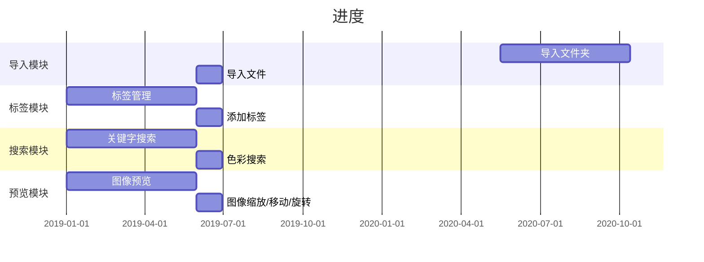

# civet

> 一个图片素材管理软件

### 下载

开发进度

### 类似软件对比
|  软件   | 开发平台  | 本地存储  | 图片支持 | Web插件 | 云盘支持 | 智能检索 | 协议 |
| :----: | :----:   |  :----: | :----: | :----: | :----: | :----: | :----: |
| Civet  | Electron | LevelDB |  | 暂无 | 暂无 | 暂无 | 开源MIT
| Eagle  | Electron | Json + 图片拷贝 |  | 有 | | | 私有
| Billfish  | Qt | Sqlite + 图片拷贝/索引 |  | Chrome | | | 私有

### 目录

[1. 导入](#导入)  
[2. 标签](#标签)  
[3. 搜索](#搜索)  
[4. 预览](#预览)  

### 功能列表

#### 1. 导入
##### 1.1 导入本地文件夹
##### 1.2 导入单个文件
#### 2. 标签
##### 2.1 自动标签生成
##### 2.2 手动添加标签
#### 3. 搜索
##### 3.1 基于文本的检索
##### 3.2 相似图片检索
##### 3.3 颜色域检索
#### 4. 预览

#### 问题反馈

如有任何使用上的问题或建议请反馈到 https://github.com/webbery/civet/issues

### 后续计划
#### 1. 底层缩略图预览优化
#### 2. 图片读取功能插件化
#### 3. 检索模块插件化
---

开发者名单：webberg
