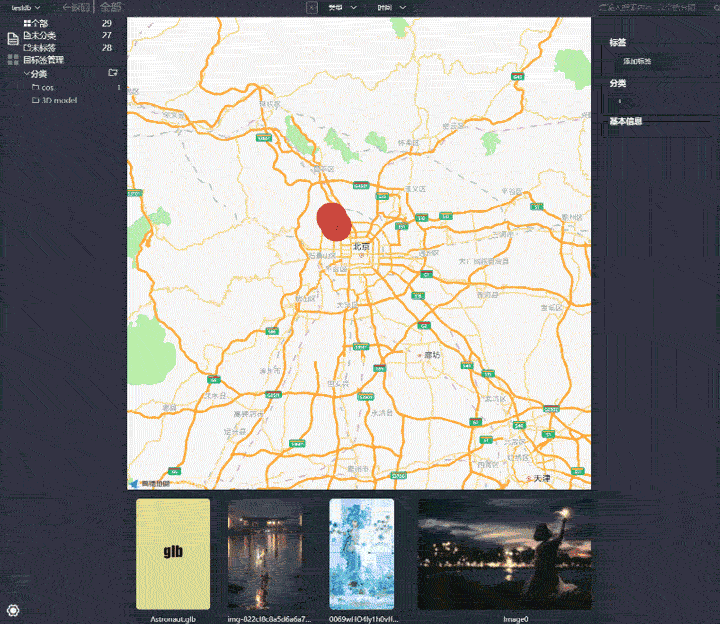
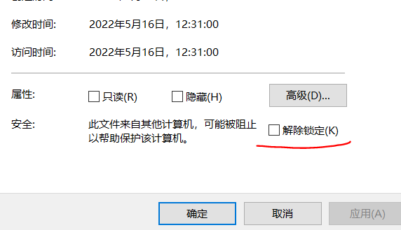

<h1>Civet</h1>
<blockquote>资源管理新体验</blockquote>

简体中文 | [English](./README-en.md)  

# 应用概述  
> :kissing_heart: 支持多平台(Windows/Mac/Ubuntu)的资源管理软件。  
目标是希望像VSCode那样，以扩展的形式为用户提供一个数字资产(图片、文档、视频、文献、网页等)的管理软件。

# 目录
<!-- vscode-markdown-toc -->
* 1. [Build/Install](#BuildInstall)
* 2. [Wiki](#Design)
* 3. [RoadMap](#RoadMap)
* 4. [类似软件对比](#SoftComp)

<!-- vscode-markdown-toc-config
	numbering=true
	autoSave=true
	/vscode-markdown-toc-config -->
<!-- /vscode-markdown-toc -->
##  1. Build/Install

开发版本下载链接: [Development Version](https://github.com/webbery/civet/releases)  
当前windows环境下因为没有签名的原因，所以需要在安装文件的右键“属性”->“常规”中关闭掉安全选项  
  
由于版本更新比较慢，所以也可以自行编译。  
编译安装方式：
  - 确保自己平台的node版本是**node 14**，C++编译器支持C++17。如果使用的是Ubuntu16，可以使用`update-alternatives`命令安装并切换高版本的gcc
  - 在下载的源代码目录下，运行`npm install`安装相关的依赖包
  - 执行`npm run build`打包安装包；执行该命令会安装插件的依赖项
  - 如果是在Mac环境下，请确保自己的环境能够进行签名打包

##  2. wiki
[插件开发](https://webberg.gitee.io/civet/extension.html)  
[浏览器扩展接口](https://github.com/webbery/civet-extension)  
[浏览器图片下载扩展(支持firefox/chrome/opera)](https://github.com/webbery/image-steam)  
[讨论区](https://gitter.im/webbery/civet)  
[Wiki](https://github.com/webbery/civet/wiki)  
  - [如何实现vscode的require劫持](https://zhuanlan.zhihu.com/p/382381432)  
  - [civet的图像主色彩抽取算法](https://zhuanlan.zhihu.com/p/355278737)  
  - [Node如何调用C++代码](https://zhuanlan.zhihu.com/p/395634920)  
<!-- [插件市场](https://webberg.gitee.io/civet/market.html)   -->

**道阻且长，行则将至。**
    
##  3. Feature/RoadMap
:white_square_button: 自定义界面扩展，增加数据源插件功能，以支持多种格式(本地及网页等)的数据读取和展示  
+ [ ] 增加存储插件功能，以支持多种数据存储方式(如本地复制、云存储等)  
+ [x] 支持信息提取的插件开发，利用插件可以为不同类型的文件抽取信息，并进行存储与检索  
+ [ ] 引入HTML5批注规范，为各种类型的文件增加批注功能  
+ [ ] 升级数据库，增强搜索(经典筛选+[向量搜索](https://zhuanlan.zhihu.com/p/458339468))功能  

##  4. 类似软件对比
|  软件   | 界面 | 开发语言  | 本地存储  | 协议 | 平台
| :----: | :----: | :----:  |  :----: | :----: | :----: |
| Civet  | Electron | Typescript/C++ | [lmdb](https://zhuanlan.zhihu.com/p/70359311) | 开源MIT | Windows/Mac/Ubuntu
| Eagle  | Electron | Js | Json/图片拷贝 | 私有 | Windows/Mac
| Billfish  | Qt | C++ | Sqlite + 图片拷贝/索引 | 私有 | Windows/Mac
| PicSee  | ObjectC | ObjectC | Realm | 私有 | Mac

内置插件支持的文件格式：  
图片: jpg png bmp tif  
3D模型: glt  
## Contributors
<!-- readme: contributors -start -->
<table>
<tr>
    <td align="center">
        <a href="https://github.com/webbery">
            
             
            <b>Webberg</b>
        </a>
    </td></tr>
</table>
<!-- readme: contributors -end -->